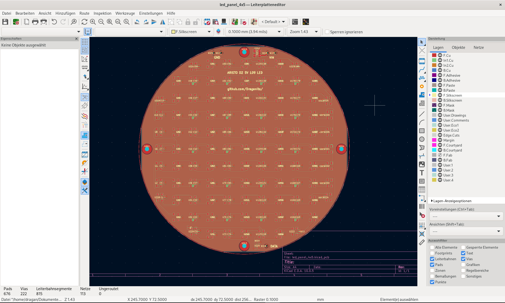
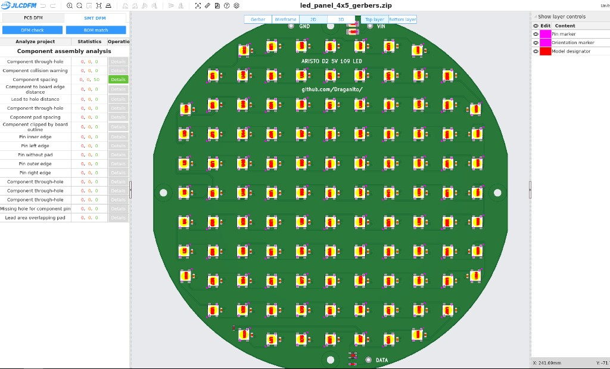
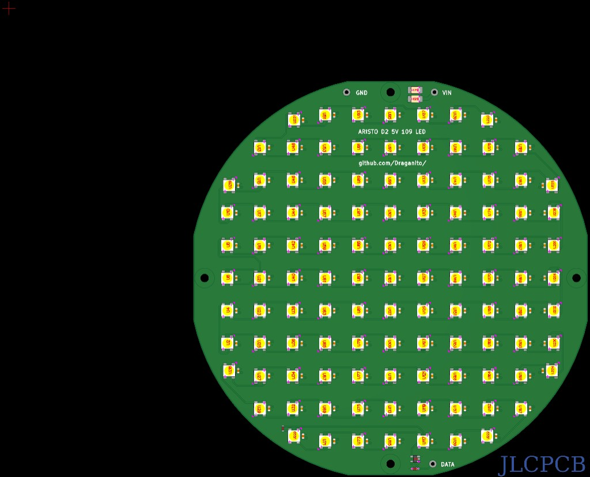

# kicad-mcp

I built this because I needed a replacement LED panel for my
**Besseler 4×5** enlarger (MILUKA Aristo D2). I had never designed a
PCB, and I did not want to learn KiCad by clicking through menus.

So you keep **KiCad** open. In **Cursor** you tell an assistant what
the board should be. It places parts, assigns nets, pours copper, and
writes the JLCPCB zip — on the board you already see.

This is not a second PCB editor and not “chat, invent a `.kicad_pcb`”.
KiCad stays the source of truth. Every change is **Ctrl+Z**.

The board that started it:
[contrib/aristo-d2-led-panel](contrib/aristo-d2-led-panel) — 109 SK6812,
4 layers, ordered from JLCPCB.







**Deutsch:** [Einstieg](ANLEITUNG_FUER_ANFAENGER.md) ·
[Neuinstallation](docs/INSTALL_DEBIAN.md) ·
[Handbuch](docs/HANDBUCH.md)

**English:** [Getting started](docs/GETTING_STARTED.md) ·
[Install on Debian](docs/INSTALL_DEBIAN.en.md) ·
[Manual](docs/MANUAL.md)

---

## Who this is for

Students, hobbyists, makers on **Debian/Ubuntu** who want help with
the boring bits: a LED grid, wire pads, a GND pour, Gerbers that
JLCPCB accepts.

You still decide the circuit. The assistant should not invent pin
functions — those come from the LCSC / EasyEDA part.

Skip this if you layout in Altium, only have Windows, or do not want
an assistant in the editor at all.

---

## What you need

- A PC with Debian or Ubuntu (x86-64)
- [KiCad 10](https://www.kicad.org/download/linux/) — not Debian’s
  KiCad 9
- [Cursor](https://cursor.com)
- An LCSC part number when you want a real JLCPCB footprint
  (e.g. `C14663` for an 0603 cap)

---

## Install

1. Download the latest `kicad-mcp_*.deb` from
   **[Releases](https://github.com/Draganito/kicad-mcp/releases)**.
2. Install it:

   ```bash
   sudo apt install ./kicad-mcp_*_amd64.deb
   ```

3. Start KiCad with **`kicad-10`** (comes with the package). Open the
   PCB editor. Enable **Preferences → Plugins → Enable IPC API**, then
   restart KiCad and open the PCB editor again.
4. Copy the Cursor template into the folder you will open:

   ```bash
   cp -a /usr/share/kicad-mcp/cursor-setup/.cursor \
         /usr/share/kicad-mcp/cursor-setup/.cursorignore .
   ```

5. In Cursor, toggle the `kicad-mcp` server off and on.

Full walkthrough (AppImage, optional autorouter):
[docs/INSTALL_DEBIAN.md](docs/INSTALL_DEBIAN.md).

---

## First thing to ask

KiCad 10 running, a board open, Cursor on that folder:

> Call `board_summary`.

You want KiCad **10.x**, `has_open_board: true`, and
`net_ipc_persists: true`. If it says 9.x, you started the wrong KiCad
— use `kicad-10`.

Then, in plain language, for example:

> Make a 40 × 30 mm board. Download C14663. Place one cap in the
> middle. Don’t save yet.

Undo is always **Ctrl+Z** in KiCad. The assistant must not save
unless you ask.

---

## How a board usually gets built

1. **Outline** — the yellow Edge.Cuts rectangle *is* the PCB. The pink
   A4 frame is only the drawing sheet.
2. **Parts** — LCSC C-numbers (`download_lcsc_part`), then place or
   a grid (`place_matrix`). Pin names come from EasyEDA, not from
   memory.
3. **Nets** — ratsnest only (`connect_many`). Copper comes later.
4. **Copper** — tracks, vias, 4-layer stack if you need it, GND/5V
   pours. Or named-net autoroute (not GND).
5. **Silk** — `5V` / `GND` / `DATA` next to wire pads. Not on copper.
6. **Check** — empty pads (`check_board`), pin coverage / ERC
   substitute (`check_pins`), clearance (`check_drc`),
   return path (`review_board`).
7. **Order** — `export_manufacturing` writes the JLCPCB zip + BOM +
   pick-and-place. Silk has no U1/C3 (JLCPCB DFM).

Coordinates are millimetres, **+x right, +y up**.

The assistant has a small tool list on purpose. The A–Z names live in
the [manual](docs/MANUAL.md).

---

## If something fails

| What you see | Usual cause |
| --- | --- |
| MCP cannot connect | PCB editor closed, or IPC API still off |
| Version 9 / nets empty | System KiCad instead of `kicad-10` |
| Writes refused | Cursor template not copied (needs `--allow-ai-write`) |
| Parts piled in the sheet corner | A bug in pad coordinates — not you; say so |

---

## Build from source

Only if you are changing the Rust code. Makers can stop at the `.deb`.

```bash
cargo test --workspace
cargo build --release -p kicad-mcp
```

Debian package: `dist/make_beta_package.sh` (needs `cargo-deb`).
Point Cursor at the **built binary**, not `cargo run`. After a rebuild,
toggle the MCP server off/on.

Layout of the repo: [docs/architecture.md](docs/architecture.md).

---

## License

[AGPL-3.0-only](LICENSE) — Copyright © 2026 Dragan Bojovic.
See [NOTICE](NOTICE).

KiCad is a separate GPL-3.0 program. This repo only talks to it over
the published IPC API.
