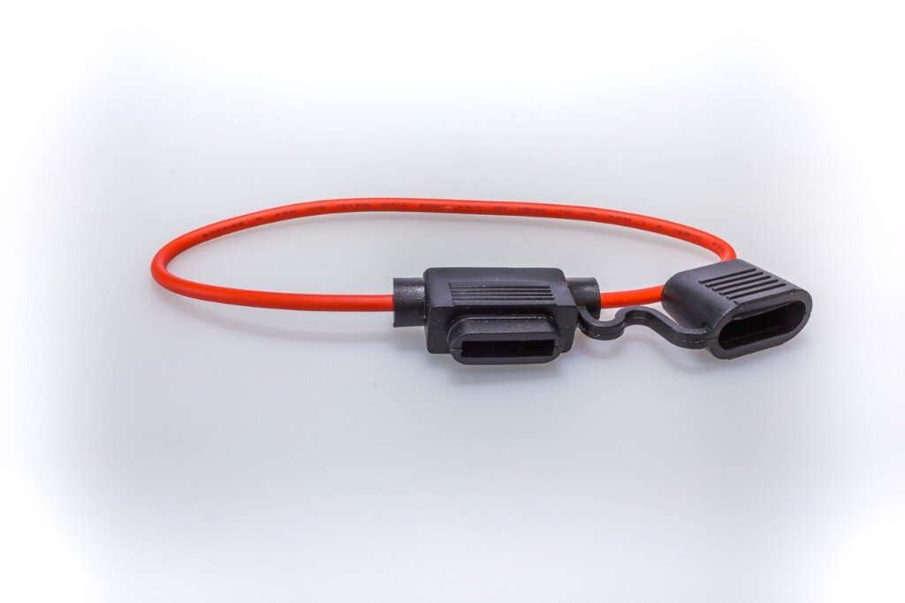
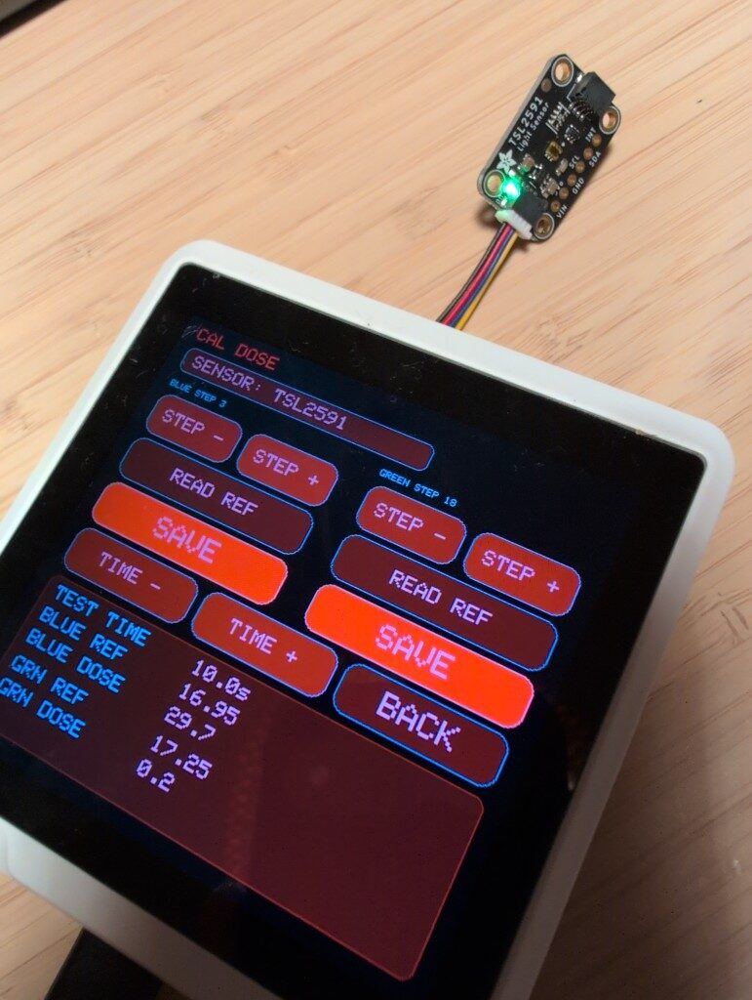
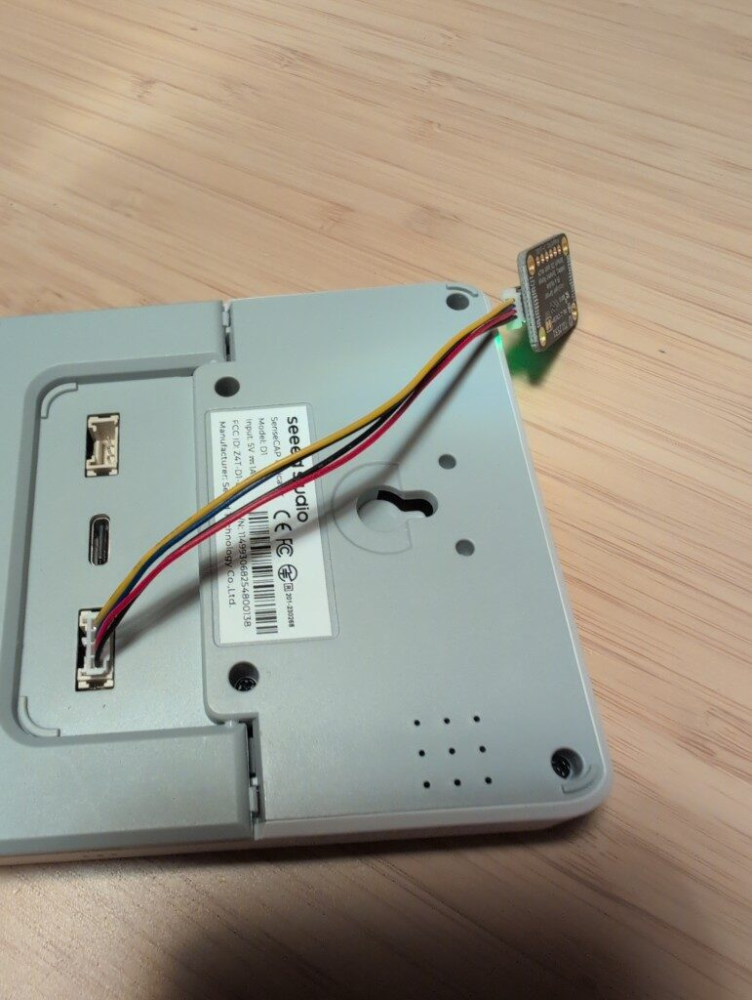
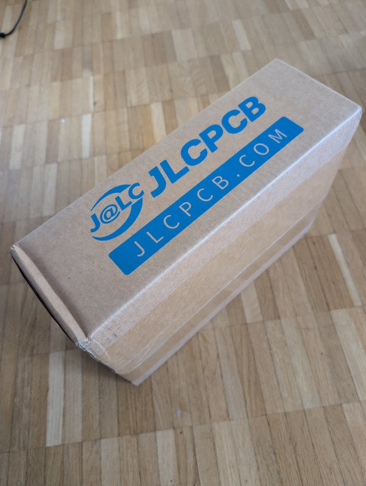
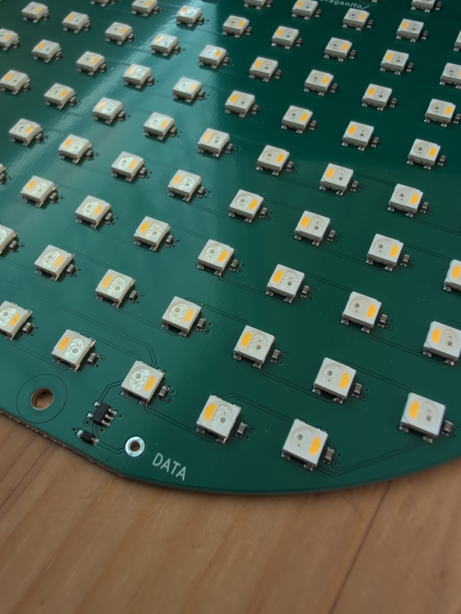
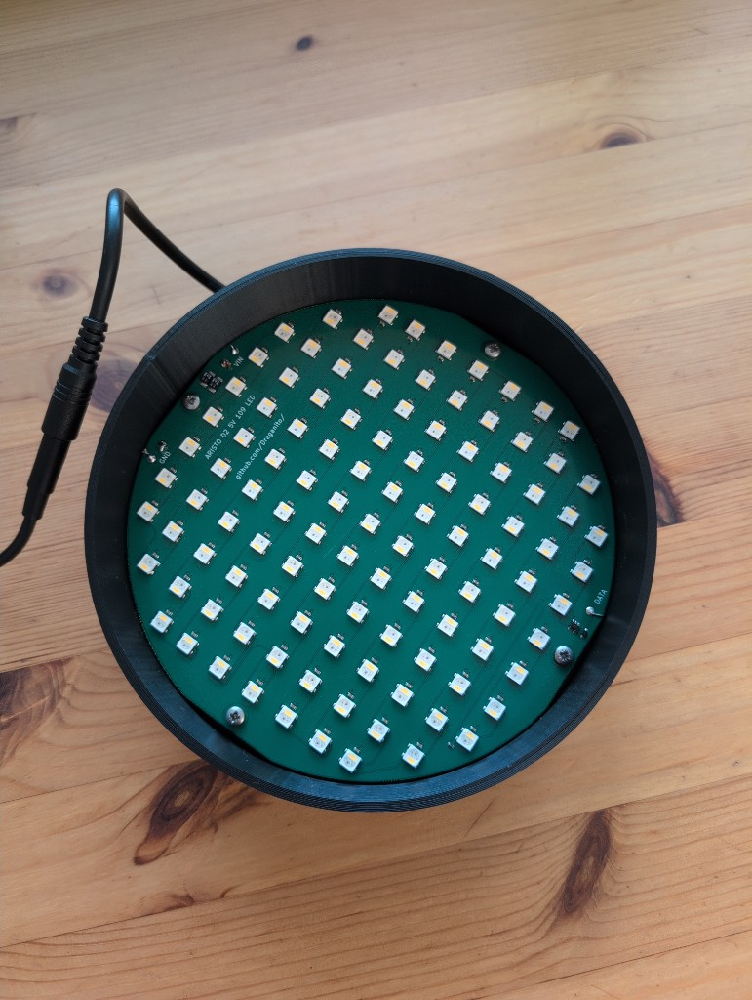
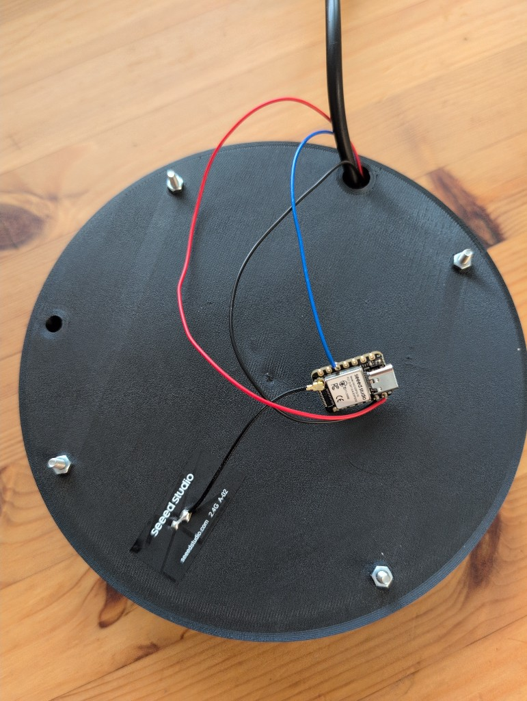
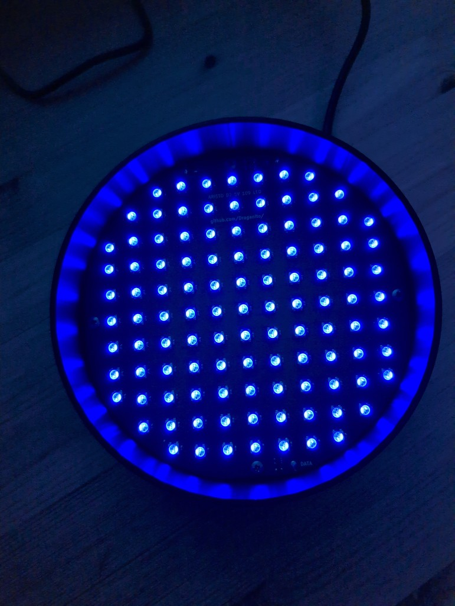
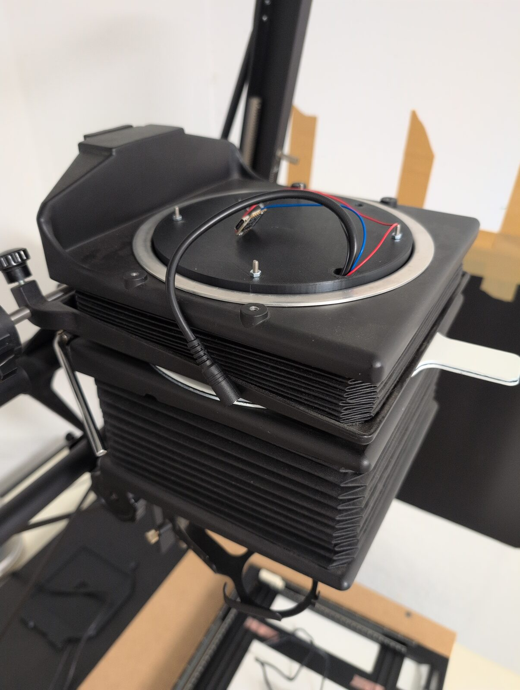
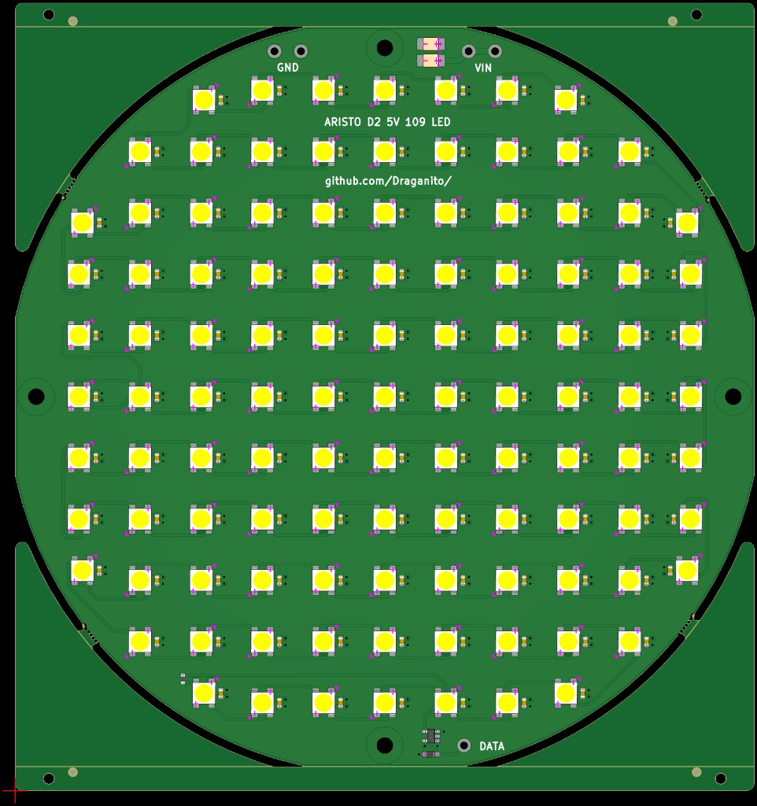

# MILUKA Aristo D2 — an open-source splitgrade system for under $150

A complete splitgrade enlarging system for a **Beseler 4×5**: a
109-LED replacement for the Aristo D2 cold light head, a wireless
receiver, a touch-screen controller (or a free Android app), and a
light meter for dose-based exposure. Everything — hardware, firmware,
CAD, apps — is open source, and the whole system costs **under $150**.

This page is the entry point. It explains how the system works and
walks you through building it, part by part. You do not need to have
designed a PCB or written firmware before — the board is ordered
ready-assembled, the firmware is a prebuilt file you flash once.

## Splitgrade in one minute

Variable-contrast paper reacts to two colors: **green** exposes the
soft (low-contrast) emulsion, **blue** the hard (high-contrast) one.
Classic splitgrade printing means two exposures — one green, one blue
— and the ratio between them sets the contrast. Normally you shuffle
filters under the lens or dial a color head.

This system does it with light itself: the panel carries 109
addressable RGBW LEDs. Green exposure, blue exposure, and a white
channel for focusing — no filters, no filter drawer, nothing moves.
The controller times both exposures and fires them back to back.

## The system at a glance

| Part | Role | Where |
| --- | --- | --- |
| **LED panel** (this folder) | Ø 157 mm, 4-layer PCB, 109× SK6812 RGBW — the light source | Gerbers/BOM/CPL here, JLCPCB builds it |
| **Holder** | 3D-printed shell, replaces the Aristo D2 head, takes the original opal glass | [FreeCAD file](../panel-holder-freecad/panel-holder.FCStd) |
| **XIAO ESP32-S3** | Receiver on the back of the holder, drives the LEDs | [darkroom-enlarger-head](https://github.com/Draganito/darkroom-enlarger-head) firmware |
| **SenseCAP Indicator D1** | 4″ touch controller — exposure, splitgrade ratio, metering (ESP-NOW, no pairing) | [splitgrade-controller-sensecap](https://github.com/Draganito/splitgrade-controller-sensecap) |
| **Android app** | Budget alternative to the SenseCAP, controls the head over BLE | [splitgrade-controller-android](https://github.com/Draganito/splitgrade-controller-android) |
| **TSL2591 sensor** | Light meter for calibration — the controller counts light, not seconds | used by the SenseCAP controller |

The head advertises as `DarkroomTimer`. Both controllers talk to the
same head firmware; you can use either, or both.

## Under $150 — the full bill of materials

List prices, one of each, no shipping or VAT. The panel price is the
JLCPCB assembled board at qty 1.

| Part | USD | Link |
| --- | ---: | --- |
| LED panel, 109× SK6812, JLCPCB SMT | 60.00 | [Gerbers in this folder](led_panel_4x5_gerbers.zip) |
| SenseCAP Indicator D1 (controller) | 49.00 | [seeedstudio.com](https://www.seeedstudio.com/SenseCAP-Indicator-D1-p-5643.html) |
| Seeed XIAO ESP32-S3 (head receiver) | 7.49 | [seeedstudio.com](https://www.seeedstudio.com/XIAO-ESP32S3-p-5627.html) |
| Adafruit TSL2591 (meter) | 6.95 | [adafruit.com/product/1980](https://www.adafruit.com/product/1980) |
| Waveshare 5 V / 5 A PSU, 5.5×2.1 mm | 6.49 | [waveshare.com](https://www.waveshare.com/psu-5v5a-5.5-2.1.htm) |
| 18 AWG DC pigtail 5.5/2.1, screws, solder, PLA+, 5 A fuse | 20.00 | — |
| **Total** | **149.93** | |

## Build it

### 1. Order the panel

JLCPCB builds and assembles the board from the three files in this
folder — you upload them, click through the options, and a soldered
panel arrives in the mail:

- `led_panel_4x5_gerbers.zip` — Gerbers + drill
- `led_panel_4x5_bom.csv` — BOM (LCSC part numbers)
- `led_panel_4x5_cpl.csv` — pick & place

Every option to click, with screenshots:
[JLCPCB_Order_Guide.pdf](JLCPCB_Order_Guide.pdf). Short version:
4 layers, 1.6 mm FR-4, LeadFree HASL, SMT on the top side.

### 2. Print the holder

The [FreeCAD model](../panel-holder-freecad/panel-holder.FCStd) is a
shell with a 165 mm outer diameter — it drops into the Beseler where
the Aristo D2 head sat. Inside: four M3 bosses the panel screws onto,
holes for the power cable, data/antenna cable, and an SMA antenna.
Print it in PLA+, the chamber walls work best white or lined white.

The **original Aristo opal glass** goes back on top as the diffusor.
With 23 mm of mixing distance between the LEDs and the glass you
cannot see the LED grid, even on large prints.

### 3. Wire it

Three wires go to the panel's labeled pads (2.8 mm pads, 1.4 mm
holes — fits 1 mm² stranded wire):

- **VIN / GND** (top of the board): from a **5.5 / 2.1 mm DC socket**
  (same barrel as the Waveshare 5 V / 5 A PSU). This build uses a
  short pigtail in **18 AWG** — that gauge matters; thinner wire
  drops voltage and heats up at 2–5 A. Keep the run short.
- **DATA** (bottom): from the XIAO's data pin (GPIO 5 / pin D4),
  through the on-board level shifter to the first LED. The data
  wire can be thinner than the power pair.

Put an **inline blade fuse on the +5 V lead, before VIN**. Do not
feed the pad unfused. A 5 A ATC/ATO fuse matches the PSU and the
panel's worst-case load. Cut the holder's red loop, splice it in
series on the positive wire only, then close the cap.

The XIAO sits on the **back** of the holder and taps 5 V and GND with
thin wires. Never route the LED current through the XIAO — the panel
draws up to 2.3 A in printing modes (green+blue or white), and the
theoretical everything-on maximum is 5 A / 25 W. That worst case never
occurs while printing, which is why the 5 A supply is enough. The load
table is printed on the back silk of the panel.

### 4. Flash the head

Download the ready-made `.bin` from the
[firmware releases](https://github.com/Draganito/darkroom-enlarger-head/releases)
and follow
[FLASH.md](https://github.com/Draganito/darkroom-enlarger-head/blob/main/FLASH.md) —
on Debian it is `apt install esptool` and one `write_flash` command.
No toolchain, no IDE.

The firmware boots with the right defaults for this panel: **109 LEDs
on GPIO 5**. It listens on ESP-NOW and BLE at the same time.

### 5. Pick a controller

**[SenseCAP Indicator D1](https://github.com/Draganito/splitgrade-controller-sensecap)**
is the primary tier: 4″ touch screen, ESP-NOW (instant, no pairing),
metering and calibration with the TSL2591. Seeed wiki:
[hands-on demo](https://wiki.seeedstudio.com/SenseCAP_Indicator_Application_LoRaWAN/#hands-on-demo).

**[Android app](https://github.com/Draganito/splitgrade-controller-android/releases)**
is the budget tier: a free APK over BLE, same head, no sensor. Sideload
steps: [INSTALL.md](https://github.com/Draganito/splitgrade-controller-android/blob/main/INSTALL.md).

How to connect (the home screen does **not** scan by itself):

1. Power the head from the 5 V supply. The XIAO advertises as
   `DarkroomTimer`.
2. On the phone: Bluetooth on, allow **Nearby devices** when the app
   asks.
3. **Do not pair** `DarkroomTimer` in Android Bluetooth settings. A
   system pair breaks the app after a firmware flash.
4. Open **miluka Splitgrade Controller**.
5. Hold **Focus** for 3 seconds → **Settings**.
6. Tap **Scan for devices**, then tap **DarkroomTimer**.
7. LED count and DATA pin default to **109 / GPIO 5** (this panel).
   Change them only for a different board, then **Save**.

A crossed-out Bluetooth icon on the timer screen means “not connected
yet” — that is normal until you finish step 6. Next launch the app
tries the last device by itself.

### 6. Calibrate and print

Plug the Adafruit TSL2591 into the SenseCAP D1 with one off-the-shelf
4-wire cable — no soldering:

- SenseCAP end: **Grove**, JST-PH **2.0 mm**, 4-pin (the lower Grove
  socket on the back of the D1)
- Sensor end: **STEMMA QT / Qwiic**, JST-SH **1.0 mm**, 4-pin

That cable is sold as **Grove → STEMMA QT / Qwiic**. It carries I2C
(SDA, SCL) plus power and GND. A Grove-to-Grove lead will not fit the
Adafruit board; a QT-to-QT lead will not fit the SenseCAP.

The controller does not store times — it stores a **target dose**
(intensity × time) per color, once per paper/developer combination.
Every print then gets a fresh measurement, and the time is computed
as `time = stored dose / measured intensity`. LED warm-up, supply
drift, a new enlarger height, a different aperture — all of it is
absorbed by the measurement instead of shifting your print.

**Calibrate once per paper/developer** — you need a **Stouffer
T2115** transmission stepwedge (21 steps, ½ stop per step; the
firmware assumes exactly this geometry):

1. Put the stepwedge in the negative carrier, the sensor on the
   baseboard.
2. Hold **MEAS BLK** ~3 seconds → the hidden calibration screen.
3. Blue side: tap **READ REF** (captures the current blue
   intensity), expose a real test print for the shown **TEST TIME**,
   develop it.
4. Find the step where the tone first reaches your target — for blue
   the first solid black — and dial that number in with **STEP +/-**.
   Tap **SAVE**.
5. Repeat for the green side; the target there is the first visible
   grey (green sets the highlights).

**Every print after that:**

1. Negative in, **FOCUS**, frame, set the aperture.
2. Sensor on the **clear film edge between frames** — not on the
   image. That is the stable, repeatable reading.
3. Tap **MEAS BLK**, then **MEAS LIT** — hard and soft times appear.
4. **EXPOSURE**.
5. Judge the print. Fine-tune with **HARD +/-** (shadows/contrast)
   and **SOFT +/-** (highlights) — do not measure again unless you
   changed height or aperture, because a new measurement overwrites
   the hand-tuned times.

**EXPOSURE** always works as an immediate stop, whatever is running.

## The panel, technically

- Ø 157 mm round, 4-layer, 1.6 mm FR-4. Layer stack: signal + GND
  pour on top, solid 5 V plane, solid GND plane, GND on the bottom.
- 109× SK6812 RGBW (LCSC C5348912) on a 12.7 mm grid, each with a
  local 100 nF cap; two 220 µF polymer bulk caps at the power entry.
- SN74AHCT1G125 level shifter and 330 Ω series resistor on DATA, TVS
  diode across the input — the usual addressable-LED hygiene, already
  on the board.
- Wire pads instead of connectors: solder three wires and done.
- Four M3 mounting holes with copper keepouts sized for screw heads.

To inspect or adapt the design: KiCad **10**, open
`led_panel_4x5.kicad_pro`. All footprints live in
`jlcpcb_parts.pretty/` (already in the project library table). Do not
edit the `.kicad_pcb` in a text editor.

## How this board was designed

I had never designed a PCB. The panel was built by telling an AI
assistant what the board should be — it fetched the real JLCPCB
parts, placed the 109 LEDs, poured the copper, checked its own work,
and exported these manufacturing files. That tool is the parent repo:
[kicad-mcp](../../README.md). If you want a panel for a different
enlarger, that is the way to make one.

## Photos & video

On the Beseler, with the XIAO on the back of the holder:

https://github.com/user-attachments/assets/cf3984b5-ae27-4c1a-a5dd-19e20b47ff94

Factory SMT view from the JLCPCB order:

Inline fuse on VIN+ (required):

TSL2591 on a Grove → STEMMA QT / Qwiic cable:

